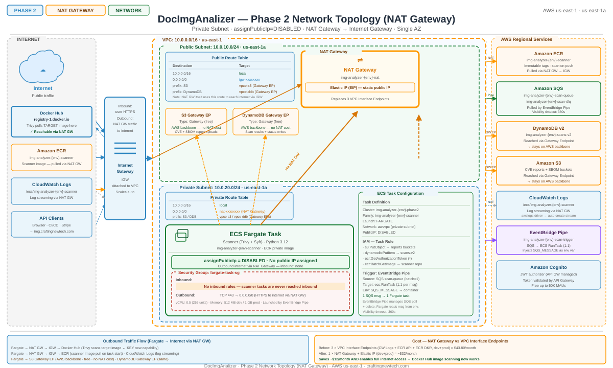

# Docker & Kubernetes Analyzer

A multi-phase SaaS application that analyzes Dockerfiles and Kubernetes manifests for security issues and best-practice violations, and performs deep CVE + SBOM scans on container images.

**Live:** [imgapp.craftingnewtech.com](https://imgapp.craftingnewtech.com)

---

## Overview

| Layer | Technology |
|-------|-----------|
| Frontend | React 18 + Vite + TypeScript |
| Backend API | Python 3.12 · FastAPI · Mangum (Lambda adapter) |
| Async scanner | Python · Trivy · Syft · ECS Fargate |
| Infrastructure | Terraform (AWS) — modular, multi-phase state |
| CI/CD | GitHub Actions — OIDC, zero stored AWS keys |
| Security | WAF, KMS CMK, VPC private subnets, immutable ECR tags |

---

## Architecture

### Phase 1 — Serverless Dockerfile Analyzer (deployed)

```
User → CloudFront (WAF) → S3 (React app)
           ↓
      API Gateway HTTP v2 (WAF)
           ↓
      Lambda (FastAPI/Mangum) → DynamoDB On-Demand
                              → S3 (reports)
```

- Scores Dockerfiles 0–100 across 11 rules (see [Rule Reference](#dockerfile-scoring-rules))
- Returns structured findings with severity, deduction, and a code-level fix suggestion
- Endpoints: `img.craftingnewtech.com/api/v1/`

### Phase 2 — Authenticated Deep Scanner (deployed, business logic pending)

```
User → Cognito (auth) → JWT Authorizer → API Gateway → Lambda v2
                                                          ↓
                                                    SQS Queue
                                                          ↓
                                               EventBridge Pipe
                                                          ↓
                                             ECS Fargate (VPC private subnet)
                                               Trivy CVE scan + Syft SBOM
                                                          ↓
                                               S3 (CVE reports + SBOM reports)
                                               DynamoDB v2 (scan results)
```



- Cognito user pool with email verification
- Asynchronous image scanning — submit and poll
- Full CVE report (Trivy) + Software Bill of Materials (Syft) per image
- Endpoints: `img.craftingnewtech.com/api/v2/`

### Phase 3 — Billing & Monetization (planned)

- Stripe Free / Pro / Enterprise tiers
- API key issuance and rate limiting
- GitHub Action for automated CI/CD integration
- Re-scanning via EventBridge scheduled rules

---

## Dockerfile Scoring Rules

Dockerfiles are scored 0–100. Each finding deducts points from 100.

| Rule | Severity | Deduction | Trigger |
|------|----------|-----------|---------|
| R001 | ERROR | -20/occurrence | `:latest` or no tag on `FROM` |
| R002 | ERROR | -25/occurrence | No `USER` or `USER root`/`USER 0` |
| R003 | WARNING | -10 | No `HEALTHCHECK` |
| R004 | ERROR | -30/occurrence | Secret key name in `ENV`/`ARG` (e.g. `DB_PASSWORD`, `API_TOKEN`) |
| R005 | ERROR | -20/occurrence | `curl`/`wget` piped to `bash`/`sh` |
| R006 | WARNING | -5/occurrence | `ADD` for local files instead of `COPY` |
| R007 | WARNING | -5 | More than 1 `RUN` instruction |
| R008 | WARNING | -10 | Single-stage build (not `scratch`) |
| R009 | WARNING | -10 | Non-minimal final base (not alpine/slim/distroless/chainguard/busybox/scratch) |
| R010 | WARNING | -10 once | `apt` without cleanup / `pip` without `--no-cache-dir` / `apk` without `--no-cache` |
| R011 | WARNING | -5 once | `npm install` instead of `npm ci` |

---

## Project Structure

```
.
├── backend/
│   ├── app/              # Phase 1 — Lambda handler (FROZEN — no Phase 2 edits)
│   │   └── main.py       # FastAPI app, rules engine (R001–R011)
│   ├── v2/               # Phase 2 — Lambda v2 handler
│   │   ├── main.py
│   │   ├── routers/      # analyze, results, health
│   │   ├── auth/         # Cognito JWT verification
│   │   ├── db/           # DynamoDB v2 client
│   │   ├── services/     # SQS producer
│   │   └── models/       # Pydantic request/response models
│   ├── scanner/          # ECS Fargate container — Trivy + Syft
│   ├── tests/            # pytest (≥80% coverage gate)
│   └── requirements.txt
├── frontend/
│   └── src/
│       ├── auth/         # Cognito Amplify integration
│       ├── api/          # Axios clients (v1 + v2)
│       ├── pages/        # Login, Dashboard, Analyze, Results
│       └── components/   # Shared UI components
├── terraform/
│   ├── phase1/           # 11 modules: api_gw, lambda, dynamodb, s3, cloudfront, waf, kms, iam, monitoring, route53, acm
│   └── phase2/           # 11 modules: cognito, sqs, ecr, vpc, ecs, lambda_v2, dynamodb_v2, iam_phase2, kms_phase2, s3_phase2, monitoring_phase2
├── .github/
│   └── workflows/
│       ├── pr.yml            # Phase 1 PR checks (validate, plan, lint, test, scan)
│       ├── deploy.yml        # Phase 1 deploy (dev auto / prod manual approval)
│       ├── phase2-pr.yml     # Phase 2 PR checks
│       └── phase2-deploy.yml # Phase 2 deploy (dev auto / prod manual approval)
├── docs/                 # Architecture diagrams, guides, status reports
├── Makefile              # Local dev and CI gate commands
├── PHASE2_ACTION_PLAN.md # Detailed Phase 2 implementation plan
└── PHASE3_ACTION_PLAN.md # Detailed Phase 3 implementation plan
```

---

## Local Development

### Prerequisites

- Python 3.12, Node 22, Terraform >= 1.15.6
- [Trivy](https://trivy.dev/), [pip-audit](https://github.com/pypa/pip-audit)
- AWS CLI configured with dev credentials

### Setup

```bash
# Backend virtualenv
cd backend
python3.12 -m venv .venv
source .venv/bin/activate
pip install -r requirements.txt

# Frontend
cd frontend
npm ci
```

### Makefile Targets

```bash
make check           # Full CI gate — run before every push
make fmt             # Auto-format Terraform + Python
make test-backend    # pytest with coverage (≥80% required)
make build-frontend  # npm ci && npm run build
make smoke-test      # Hit live API to verify post-deploy health
```

`make check` runs: Terraform fmt, ruff lint, mypy, pytest, pip-audit, Trivy IaC scan (phase1 + phase2), npm lint, npm build, npm audit.

### Running the API locally

```bash
cd backend
uvicorn app.main:app --reload --port 8000
# POST http://localhost:8000/api/v1/analyze
```

---

## API Reference

### Phase 1 — `/api/v1/`

| Method | Path | Description |
|--------|------|-------------|
| `POST` | `/api/v1/analyze` | Analyze a Dockerfile — returns score + findings |
| `GET` | `/api/v1/results/{scan_id}` | Retrieve a previous scan result |
| `GET` | `/api/v1/health` | Health check |

**Analyze request:**
```json
{
  "dockerfile_content": "FROM node:latest\nRUN npm install\n..."
}
```

**Analyze response:**
```json
{
  "scan_id": "abc123",
  "score": 45,
  "grade": "F",
  "findings": [
    {
      "rule": "R001",
      "severity": "ERROR",
      "line": 1,
      "message": "FROM uses :latest tag",
      "fix": "Pin to a specific version: FROM node:22.4.0-alpine"
    }
  ]
}
```

### Phase 2 — `/api/v2/` (requires Cognito JWT)

| Method | Path | Description |
|--------|------|-------------|
| `POST` | `/api/v2/analyze` | Submit image for deep CVE + SBOM scan (async) |
| `GET` | `/api/v2/results/{scan_id}` | Poll scan status and retrieve results |
| `GET` | `/api/v2/health` | Health check |

---

## Deployment

### Terraform

Each phase has its own state file. Environments are directory-based (`environments/dev/`, `environments/prod/`).

```bash
# Phase 1 — dev
cd terraform/phase1
terraform init -backend-config=environments/dev/backend.hcl
terraform plan -var-file=environments/dev/terraform.tfvars

# Phase 2 — dev
cd terraform/phase2
terraform init -backend-config=environments/dev/backend.hcl
terraform plan -var-file=environments/dev/terraform.tfvars
```

### CI/CD Pipelines

| Trigger | Pipeline | Action |
|---------|----------|--------|
| PR → `develop` or `main` | `pr.yml` | Validate, plan, lint, test, Trivy scan |
| Merge → `develop` | `deploy.yml` | Auto-deploy to dev |
| Merge → `main` | `deploy.yml` | Manual approval gate → deploy to prod |
| Push → `phase2` | `phase2-deploy.yml` | Auto-deploy Phase 2 to dev |
| `workflow_dispatch` | any | On-demand deploy to any environment |

All pipelines use GitHub OIDC — no AWS access keys are stored as secrets.

### Required GitHub Setup

1. **Environments**: create `development`, `production`, `phase2-development`, `phase2-production` in repo Settings → Environments
2. **Variables**: set `AWS_ROLE_ARN` at repo level (dev role) and per environment (env-specific role)
3. **Production gate**: `production` environment requires manual reviewer approval before deploy

---

## Security Design

- **WAF**: attached to both CloudFront (frontend) and API Gateway (API)
- **KMS CMK**: DynamoDB, S3 reports bucket, Lambda env vars, SQS queue, SNS topics — all encrypted with customer-managed keys
- **VPC**: ECS Fargate runs in private subnets; 6 VPC endpoints (ECR, S3, SQS, DynamoDB, CloudWatch, Secrets Manager) — no NAT gateway, no public internet access from scanner
- **ECR**: `IMMUTABLE` image tags — each push uses `$GITHUB_SHA`; `:latest` cannot be overwritten
- **IAM**: GitHub OIDC federated identity; least-privilege inline policies per phase; no long-lived credentials
- **Cognito**: user pool with email verification; JWT authorizer on Phase 2 API Gateway

---

## Documentation

| Document | Description |
|----------|-------------|
| `docs/BackendArchitectureV2.md` | Phase 2 backend architecture detail |
| `docs/Phase2TechnicalOverview.md` | Phase 2 infrastructure and design decisions |
| `docs/Phase2StatusReport.md` | Current deployment status |
| `docs/Phase2PipelineDebuggingV1.md` | CI/CD pipeline debugging log (IAM bootstrap catch-22, ECR immutable tags, etc.) |
| `docs/UserGuideV2.md` | End-user guide for the Phase 2 UI |
| `PHASE2_ACTION_PLAN.md` | Detailed Phase 2 task tracking |
| `PHASE3_ACTION_PLAN.md` | Phase 3 planning (Stripe billing, API keys) |
| `security-scan-report-2026-06-19.md` | Trivy security scan findings and resolutions |

---

## License

Private — all rights reserved.
