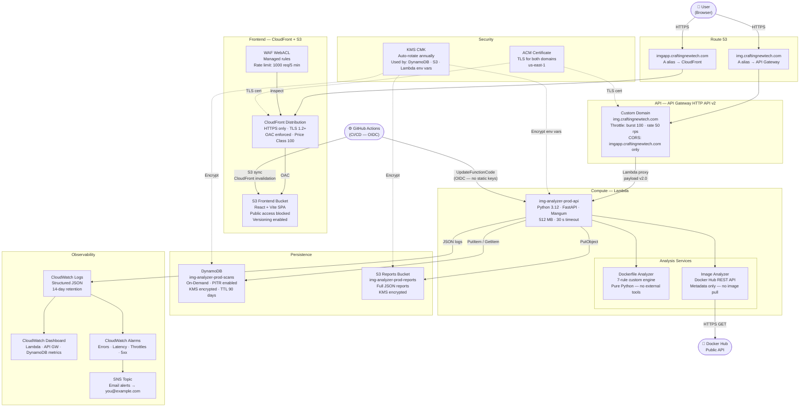
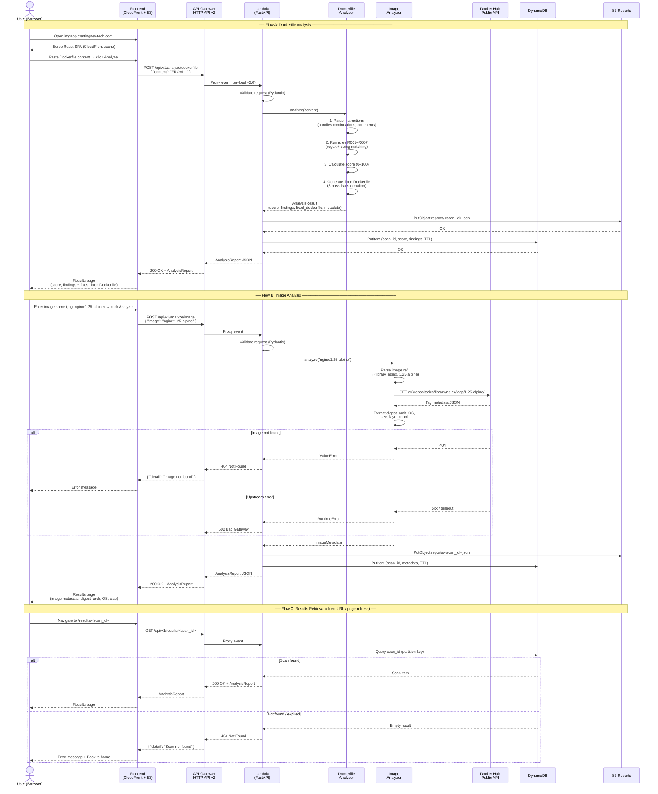
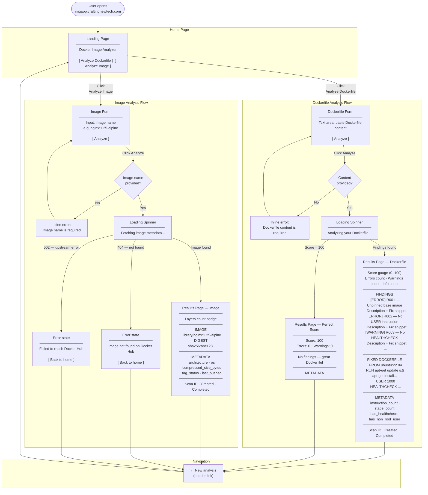

# DocImgAnalizer — Technical Diagrams (Phase 1)

All diagrams are written in [Mermaid](https://mermaid.js.org/) and render natively
in GitHub, GitLab, Notion, and most modern markdown viewers.

---

## Diagram 1 — AWS Architecture

Shows every AWS service deployed in Phase 1, how they connect, and the security
controls applied at each layer.

---

## Diagram 2 — Data Flow

Shows the step-by-step flow of data through the system for each of the three
API operations: Dockerfile analysis, Image analysis, and Results retrieval.

---

## Diagram 3 — User Interaction

Shows every screen and decision the user encounters from landing on the site
through to viewing results.

---

## Rendering These Diagrams

**GitHub** — renders Mermaid automatically in any `.md` file.

**VS Code** — install the *Markdown Preview Mermaid Support* extension.

**Locally** — use the [Mermaid Live Editor](https://mermaid.live) — paste any diagram block to preview and export as PNG or SVG.

**Export to PNG/SVG for use in presentations:**
1. Open [mermaid.live](https://mermaid.live)
2. Paste the diagram code (without the triple-backtick fences)
3. Click **Export** → PNG or SVG
